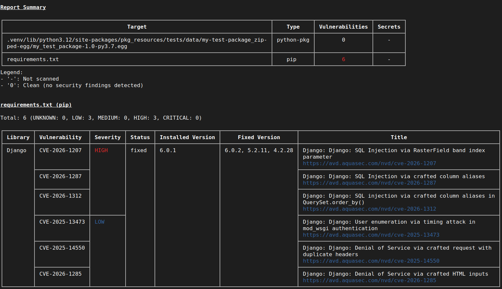

# Dependabot
GitHub ofereix **Dependabot** per:
- detectar CVEs
- Avisar de noves versions
- crear PRs automàtiques

## Activació
Per activar Dependabot s'ha de fer des de la configuració del projecte a GitHub.

A la finestra de **Security** es poden veure els resultats de l'escaneig.

## Problemes
Dependabot ha detectat problemes amb la versió de Django ja que, recentment, ha sortit una vulnerabilitat **SQL injection**.

# Eines alternatives

## Trivy
És open-source i pertany a Aqua Security. Mira repositoris, secrets i contenidors.
S'executa amb:
```bash
trivy fs .
```

### PROS
- OSS
- Ràpid
- CI-friendly

### CONS
- Menys profund en Python

### Execució local 


## Snyk
Eina molt popular per a la detecció de vulnerabilitats. Escaneja dependències i contenidors. Pertany a l'empresa SNYK.
S'empra amb una comanda a l'arrel del projecte:
``` bash
snyk test
```

També pot realitzar monitorització contínua:
``` bash
snyk monitor
```

Necessita autenticació ja que és una eina de pagament.

### PROS
- Molt complet

### CONS
- SaaS

## OWASP Dependency-Check
És una eina open-source que analitza les dependències d'un projecte per detectar CVEs.
Per emprar-la s'ha d'escriure:
```bash
./dependency-check/bin/dependency-check.sh \
  --scan . \
  --format HTML \
  --out reports
```

Pot generar informes HTML, JSON i XML.

### PROS
- Offline
- OSS

### CONS
- Lent